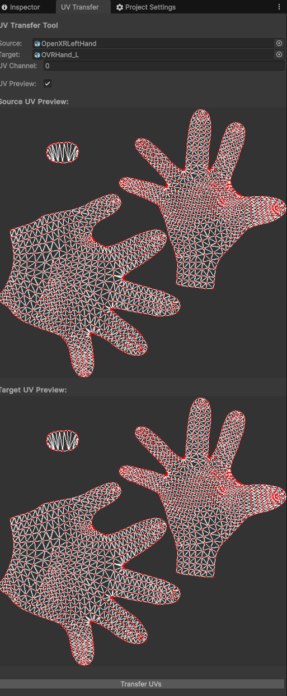

# UV Transfer Tool for Unity

A lightweight EditorWindow that lets you copy UV coordinates from one mesh to another **as long as both meshes share the exact same vertex count / topology**.

## 

## Features

* Transfer UVs from **any** of the four UV channels (0–3)
* Visual preview of source and target UV layouts
* Works with meshes referenced by **MeshFilter** _or_ **SkinnedMeshRenderer**
* Creates a new mesh asset and assigns it to the target object, preserving the original asset untouched

## Installation

### Using Unity Package Manager

* Open Unity and your project

* Go to Window > Package Manager

* Click the "+" button and select "Install package from git URL..."

* [https://github.com/inimart/UVTransferTool.git]

## Usage

1. Open the window via **Tools ▸ UV Transfer Tool**.
2. Drag a GameObject that contains the *source* mesh into the **Source** field.
3. Drag a GameObject that contains the *target* mesh into the **Target** field.
4. Enter the **UV Channel** you want to copy.
5. (Optional) Toggle **UV Preview** to display live previews.
6. Press **Transfer UVs**.
7. A _Save File_ dialog appears – choose where the new mesh asset should be written. The tool appends `"_FixedUV"` to the original target mesh name by default.
8. After saving, the new mesh is automatically assigned to the target object so you can inspect the result instantly.

## Requirements

* Unity **2023.2** or newer
* `Read/Write Enabled` must be checked on both meshes (import settings)
* Source and target meshes **must have the same vertex count**

## Limitations

* Does **not** perform any UV transformation (scale / offset / rotation) – it is a 1‑to‑1 copy
* Only one UV channel can be transferred per operation
* Editor‑only – cannot be used at runtime in a build
* Preview resolution is fixed to 512 px and may miss fine details on very dense meshes

## Documentation

A step‑by‑step tutorial and troubleshooting tips can be found in **`Documentation~/UVTransferTool-Guide.md`**.
